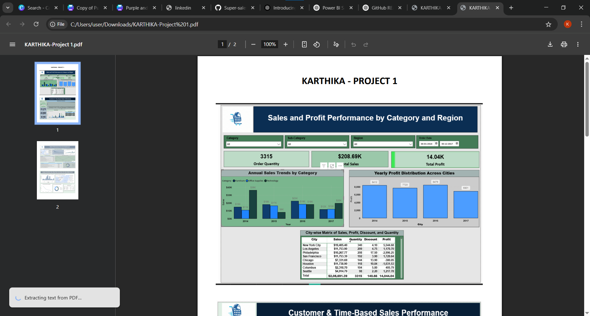
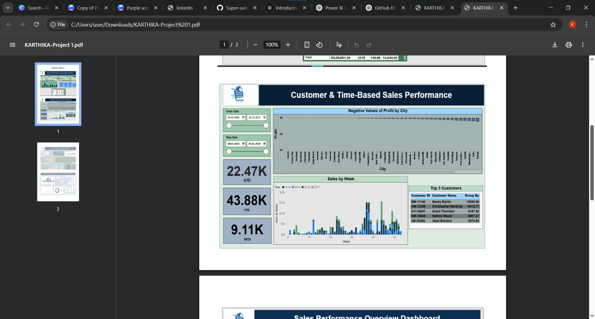
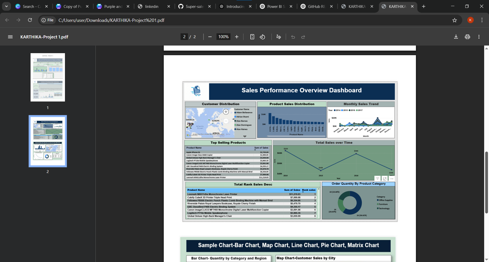

# 📊 Power BI Sales Analysis Dashboard

This project presents an interactive Power BI dashboard designed to analyze and visualize sales performance across various dimensions like Region, Segment, Category, and Sub-Category. The dashboard helps users quickly understand key trends, compare metrics, and make data-driven decisions.

---

## 🚀 Project Overview

The dashboard offers a visual summary of business sales, providing stakeholders with insights on:

- Which products or sub-categories are performing best
- Regional sales and profitability patterns
- Performance over time
- Discounts and their effect on profit
- Segment-wise customer analysis

---

## 📌 Features

✅ **Key KPIs Displayed:**
- Total Sales
- Total Profit
- Total Quantity Sold
- Average Discount Given

✅ **Visualizations Included:**
- Clustered bar chart of sub-category sales and profits
- Line chart showing sales trends over time
- Tree map of segment-wise sales
- Top N product tables by sales and profit
- Regional sales distribution

✅ **Interactive Slicers:**
- Year
- Region
- Segment
- Category
- Sub-Category

---

## 🛠 Tools & Technologies Used

- **Power BI Desktop** – Data visualization and report creation
- **DAX (Data Analysis Expressions)** – Calculated fields and KPIs
- **Excel / CSV Dataset** – As the data source (assumed)
- **Slicers & Filters** – To enable data-driven exploration

---

